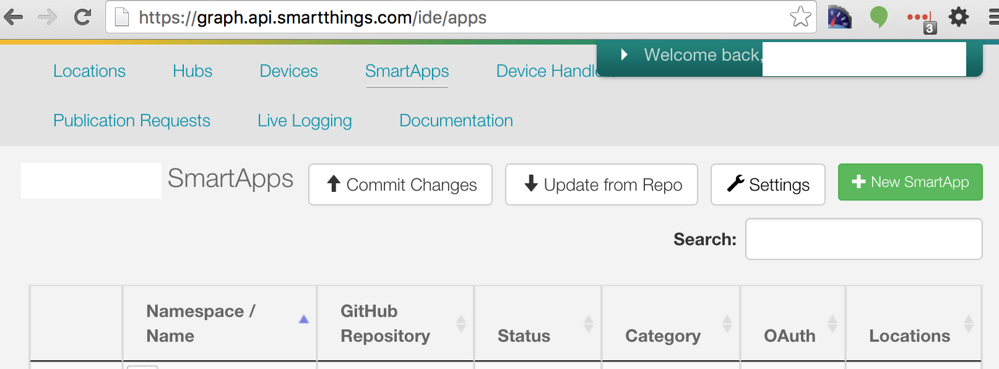
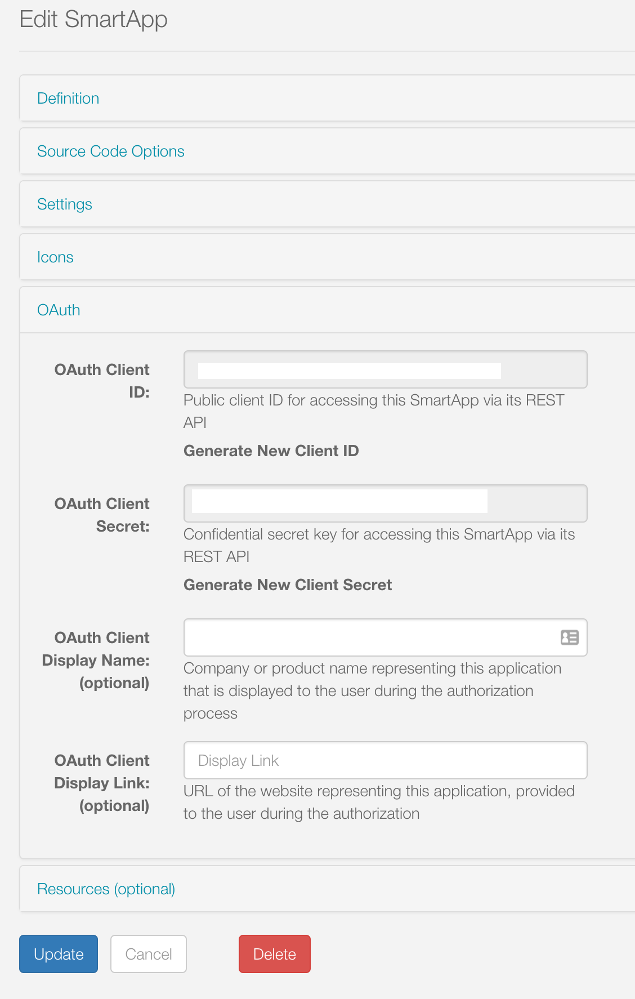

# Overview of Steps
This document describes how to manually install the j64Harmony smart app and device types.

# Step 1 - Install the j64Harmony Smart App
First make sure you have an account setup here:  https://graph.api.smartthings.com/login/auth.  It is free for everyone so just sign up if you don't have one already.

Next, select the SmartApps option at the top of the web page to show all of the smart apps you have already installed.  Once there, click on the big green "New SmartApp" button on the right side of the page.

 

The next page that comes up will have a form to create a new smart app.  You should select the "From Code" option at the top of the page.

 

That will open up a blank text box.  Copy all of the code from src/j64.Harmony.WebApi/SmartThingApps/j64HarmonySmartApp.groovy into that text box.  Then click the Create button at the bottom of the page.

That will bring up the editor for the smart app.  At this point you will want to click the "Publish" button at the top of that page.  This will publish the smart app and make it avaialble for use under your personal ID.

 

Now that you have published the app you will need to get an Oauth key that will be used down on step #9.  To do this click the "App Settings" button next the the publish button.  That will take you to the following page.  Open up the Oauth Section and click "Enable Oauth in Smart App" button. You will need the Oauth Client ID & Oauth Client Secret down in step #8.  

Be sure to click the Update button at the bottom of this page or it will not actually save that Oauth information.

 

# Step 2 - Install all of the j64 Device Types
The process for install custom device types is almost identical to smart apps.  The only difference is that you will select the "Device Handlers" option at the top of the page.  Once there you will click on "Create New Device Handler", then select the "From Code" option.  Finally just like you did for the smart app you will need to publish the device handler once you have created it.

You will want to create custom device handlers for each of the following files:
* j64ChannelSwitchDevice.groovy
* j64SurfingSwitchDevice.groovy
* j64VCRSwitchDevice.groovy
* j64VolumeSwitchDevice.groovy

